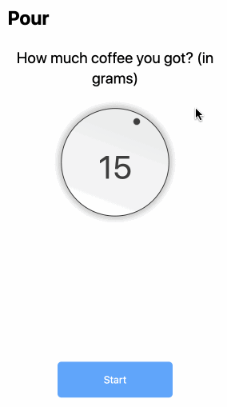

# Pour
This repo serves as a host for various coffee apps written in for various platforms

Currently, a person may use Pour to guide their pourover sessions:
- Configure the amount of coffee grounds you have (in grams)
  - The coffee-water ratio follows a standard 1 : 17ish ratio
- Walk through pourover sessions in a series of steps
  - Each step contains how much water to pour, and the target wright
  - When using a scale, this may help you keep track of your progress 

**Pure React Demo**:

**What this app does not do (yet?)**
- Give guidance on grind size for coffee
- Allow input of how much water as opposed to coffee
- Set different ratios of coffee-to-water
  - Could be nice if using a Chemex with a larger weight of coffee (40g+) 
